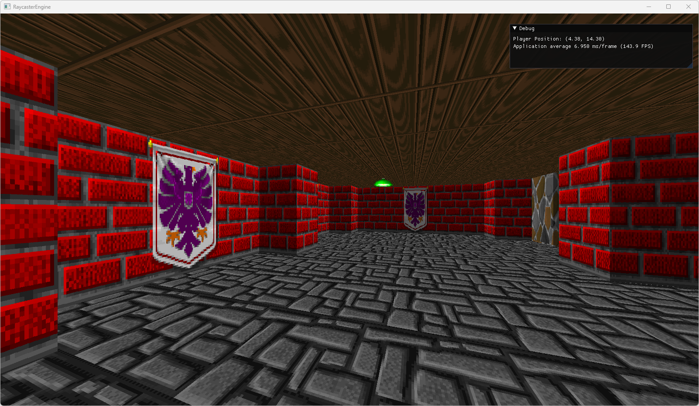

# 2D Raycaster Engine
Traditional 2D raycaster engines run on CPU so they have a bottleneck on loading screen texture from CPU to GPU for each frame.

This raycaster engine is implemented using compute shaders so it does not have this bottleneck as it runs on GPU.

Textures belong to Wolfenstein 3D game.

Raycaster codes are taken from Lode Vandevenne's  [tutorials](https://lodev.org/cgtutor/raycasting.html) and adopted.

## Screenshot

## Build
Simply open `RaycasterEngine.pro` with `Qt Creator` and build it with kit `Qt 6.3.0 MSVC2019 64bit` and run. Other compilers should also work.
